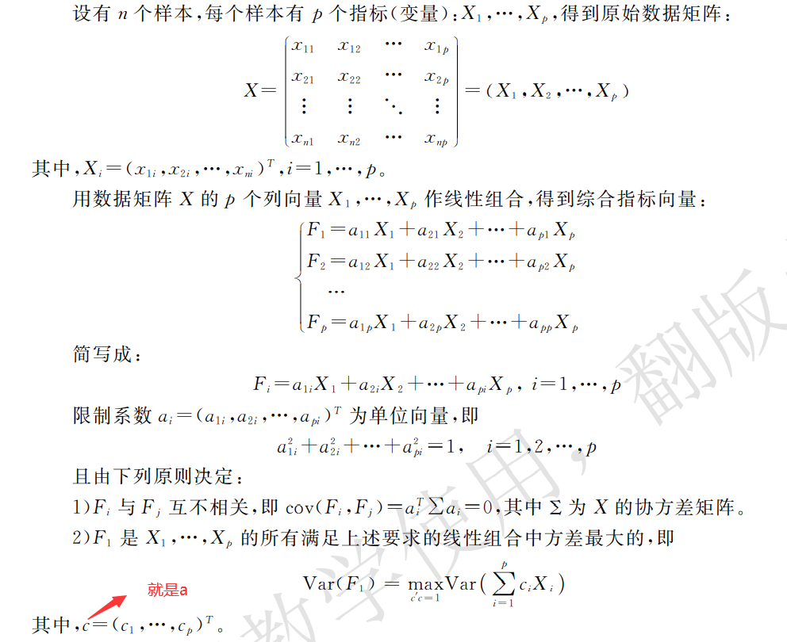
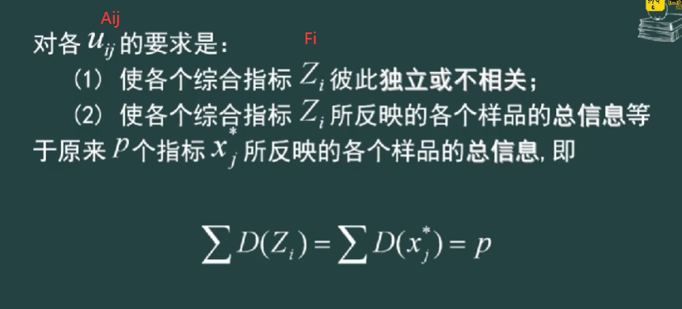
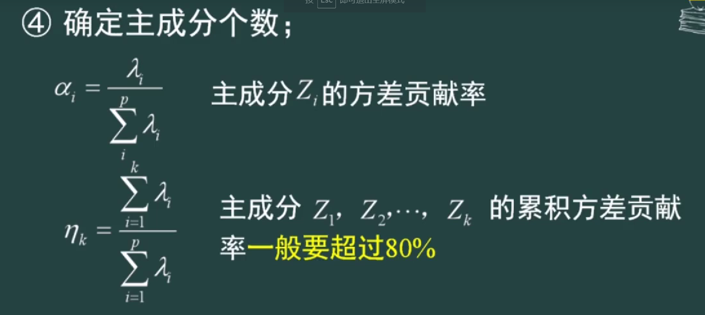
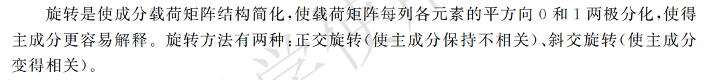

## 作用

- 在多种因素中找到主要因素
- 在综合评价中要求指标之间线性无关，要将同类指标合并
- 在线性回归中，自变量要求线性无关

## 步骤

### 标准化处理

对原始n个样本，p个指标(变量)矩阵进行**标准化处理**-`zscore()`

将原始变量线性组合成主成分F_i(新变量)

即
$$
F = AX
$$

计算标准化矩阵X的特征值lambda与特征向量R使用`corrcoef`函数

### 确定主成分系数

根据公式
$$
D(AX) = ARA' = \lambda \\
$$
得到主成分系数矩阵

### 确定主成分个数

某个新变量方差对总体方差的贡献率

即确定建立的新变量的个数，一般方差贡献率按从大到小排序，贡献率越大表明信息的贡献比例越大，第一个贡献率最大，称为第一主成分，依次累加达到80%,后面的信息比例少，不要

### 主成分旋转

得到的新变量-主成分是原始变量的线性组合，通过对主成分系数的旋转，将系数向01分划，得到某些影响较大的变量的组合，而将影响小的变量剔除了，使主成分更容易解释，同时也将这些指标归为一类

### 建立组成分方程

$$
Z = AX
$$

## 实际方法

1. 对矩阵X标准化`z = zscore(x)`
2. 求R矩阵`cor = corrcoef(z)`
3. 求特征值特征向量`[vec, val] = eig(cor)，newval = diag(val)`剔除特征值，`newy = sort(newval, 'descend')`降序排序
4. 得到排序后的特征值，求a_i，得到方差贡献率`new_y./sum(new_y)`，进而得到主成分个数
5. 得到对应主成分的系数=>得到主成分方程=>计算得分

