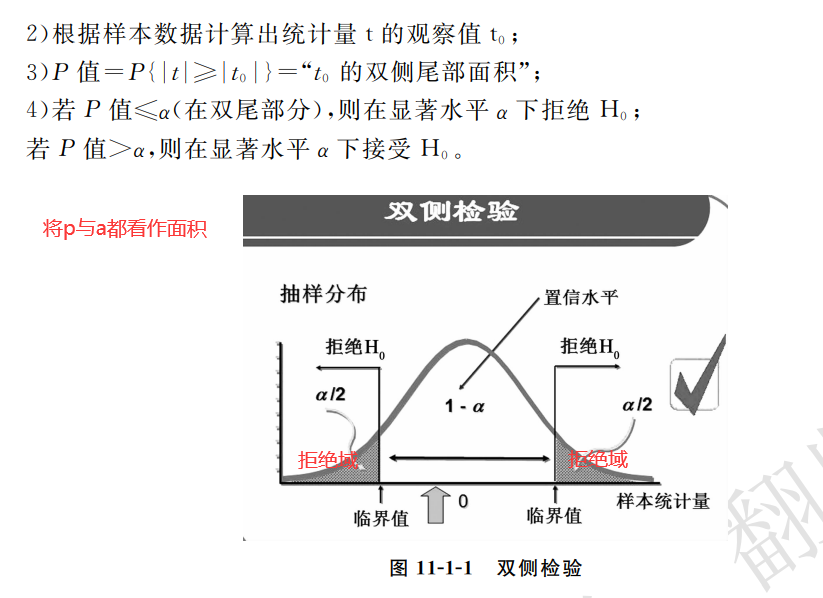

## 假设检验

在实际中我们无法得到总体数据，要通过样本数据来推断总体的特征

基本思想：小概率反证思想

提出原假设`H0`-想反对的假设(概率较小的)

备择假设`H1`-想支持的假设

给定一个显著性水平alpha(当H0为真时，错误拒绝的概率)，用样本求出p值(当H0为真时，错误拒绝的实际概率)，若p<alpha，表明错误拒绝H0的概率非常小，认为偶然性造成的错误较小，所以可以拒绝H0；反之表明出错的概率大，无法拒绝H0。

## 单侧与双侧检验 

要根据题意来判断

若要检验某药物是否有效，是否有提高(右侧检验)等，则为单侧检验

若要看是否有显著差异则为双侧检验

## 正态性检验

H0：服从正态分布

H1：不服从正态分布

S-W检验(W检验)：适合样本量8<=n<=50的情况

D检验：适合样本量50<=n<=1000的情况

Q-Q图检验

## 均值t检验

用于检验两组数据的均值是否有显著性差异

**条件**：数据服从正态分布、满足方差齐性

## 卡方检验

要求：数据相互独立、样本数大于等于5

用途：

- 拟合优度检验
- 独立性、关联性检验-两分类变量是否独立
- 同质性检验-两样本是否来自同一总体

### 分类变量的独立性检验

用相关系数求两个分类变量间的关系不太好，因为可能都是0、1的值

使用`crosstab()`进行独立性检验
