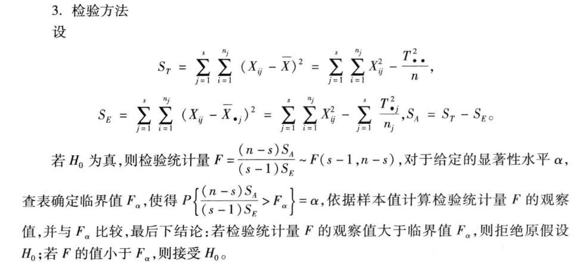
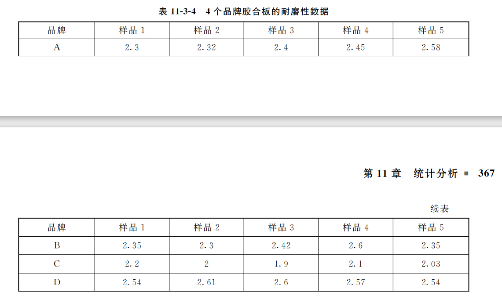

## 方差分析

### 目的

某一因素对某一因变量是否有影响

哪些因素是主要的、次要的

最佳水平，所有因素的某一水平下因变量结果最佳

### 概念

**因变量**-结果的指标

**因素**-相当于自变量

**水平**-某一自变量下不同的状态称为水平

## 建模步骤

### 数据检验

因素下所有水平的**正态性检验**与**方差齐性检验**-使用`vartestn()`

### 假设检验

各水平下实验均值是否有显著性差异
$$
H_0:u_0=u_1=u_2=...=u_n
$$
即无显著性差异

`H1`为不全相等

见《数学建模算法与应用》

可使用`anoval()`函数进行分析

若有显著性差异可通过比较两两不同水平的均值来判断差异性-使用`multcompare()`

方差分析对离群点非常敏感，要检验是否有离群点

### 例

**因变量：**鞋子的磨损深度

**因素：**品牌

**水平：**不同的品牌

## 双因素方差分析

在分别检验两个因素后还要考虑两因素之间的交叉效应